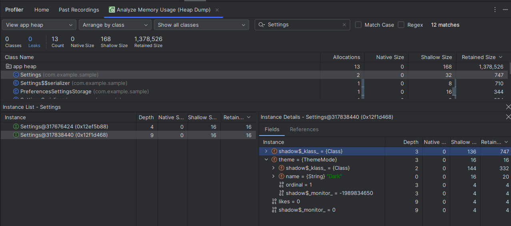
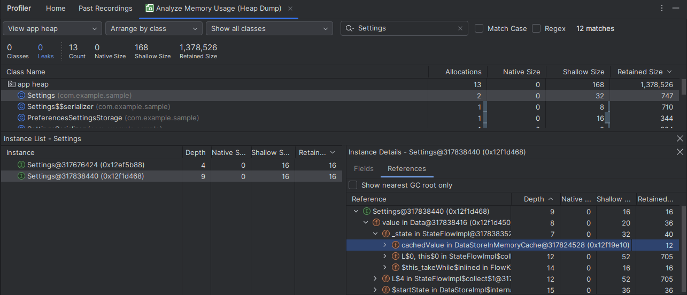
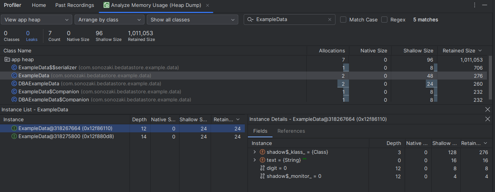
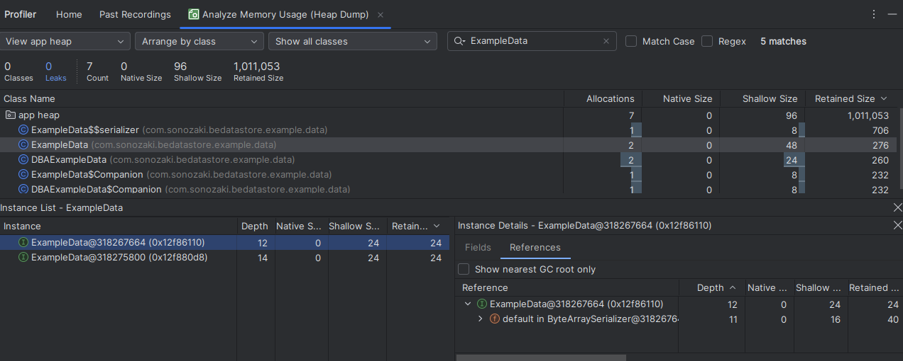
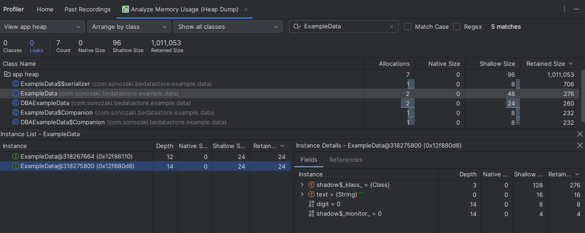
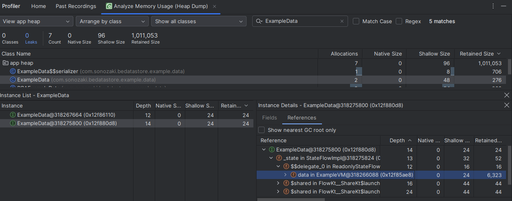

# Better Encrypted Datastore
Better Encrypted Datastore is a library for securely storing encrypted data inside Datastore. It allows you to combine strong encryption with the convenience of reactive programming. In addition, the library extends Datastore's capabilities by adding the ability to store a Datastore file in device encrypted storage, making data from it accessible before the first device unlock.

## Comparison with existing analogues
Existing libraries for encrypting data inside a Datastore, such as [Encrypted DataStore](https://github.com/osipxd/encrypted-datastore), are limited to only encrypting the file where the data is stored. However, DataStore is designed in such a way that the data is stored in a cache in RAM after it is initially loaded from the file, rather than being read from the file each time the data is accessed. In existing libraries, the values in this cache are not encrypted. Furthermore, Datastore is implemented as a singleton, which means that this decrypted data will be in RAM the entire time the application is running.

On screenshots below you can see that unencrypted data remains in RAM long time after user put application in background.

This design protects from some attacks, but opens the door for attackers to perform an attack by extracting data from a RAM dump. Although difficult due to code obfuscation, this attack has already [shown to be effective](https://cellebrite.com/en/decrypting-databases-using-ram-dump-health-data/) against encrypted databases. In addition, on some devices, RAM dumps can be obtained even without root privileges.

In my library, not only the DataStore file is encrypted, but also the cache. It adds a separate cache on top of the existing DataStore cache to store decrypted data. This cache will be filled with values at the first subscription to the data stream and overwritten with an empty value when all subscribers unsubscribe from the data stream. Thus, decrypted data will not be stored in RAM longer than necessary for user.

On screenshots below you can see that no actual data remains in RAM when user put app in background - only default values. 

My library also provides possibility to store encrypted and unencrypted data in device protected storage. That makes data from datastore accessible before first unlock.

## Limitations

Better Encrypted Datastore prevents upstream data leakage, but cannot prevent downstream leakage, such as in the presentation layer. It is up to you to take care of data security after it leaves the DataStore. For example, if you want to expose data flow as StateFlow in ViewModel, it is recommended to use the SharingStarted.WhileSubscribed() strategy with replayExpirationMillis parameter specified. This parameter configures a delay (in milliseconds) between the stopping of the sharing coroutine and the resetting of the replay cache.

## Usage
You can use Better Encrypted DataStore as usual DataStore. Just add this to your build.gradle:

`implementation 'com.github.bakad3v:BetterEncryptedDatastore:1.0.0-alpha'`

And use extension function encryptedDataStore as the usual Datastore.

`private val Context.exampleDatastore by encryptedDataStore(NAME, ExampleSerializer())
val data = context.exampleDatastore.data`

You can also specify additional parameters:

alias - encryption alias. By default - the name of the Datastore file.

isDBA: Boolean - is Datastore file stored in device protected storage. By default - false.

If you want to store unencrypted data in device protected storage, you can use another extension function dataStoreDBA.
`private val Context.dbaDatastore by dataStoreDBA(DBA_NAME, DBASerializer())`

## Examples
This library is used for storing data in my open-source app [Android Antiforensic Tools](https://github.com/bakad3v/Android-AntiForensic-Tools).

## Donate
You can support me using crypto.

XMR: 88Z5fsVK6FP4oVNjo2BrHydAEa5Y1gTPi5d7BN68sjVDZ9dTn8wPb89WmUxrxf3T37bRGSR5dekkU9aQ7j8ErWcBJ2GZojC

LTC: ltc1qtfhun6yzt0qlpa9d6s8gr2yd70sg0kx755u3se

BTC: bc1qn9a9eyy2vgrz8yvhk0654d63dt56pxhpn6q4xl

BTC lightning: dualwhorl66@walletofsatoshi.com
